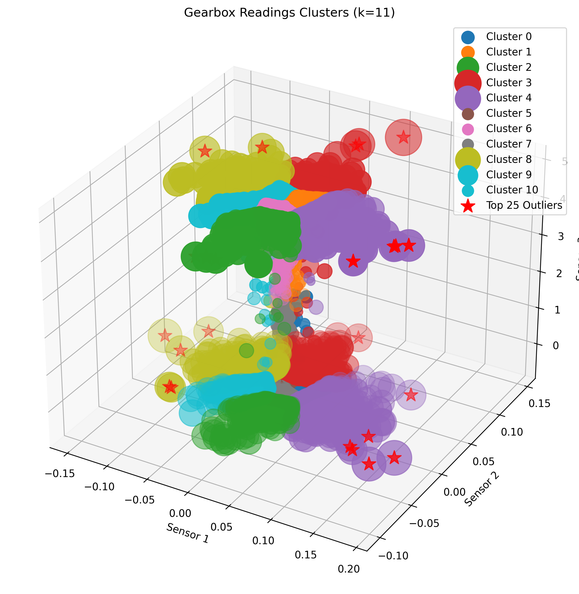
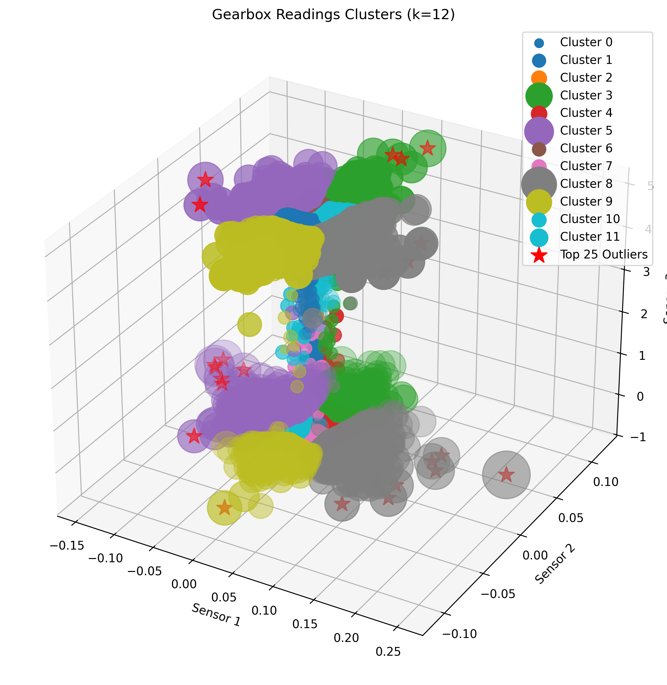
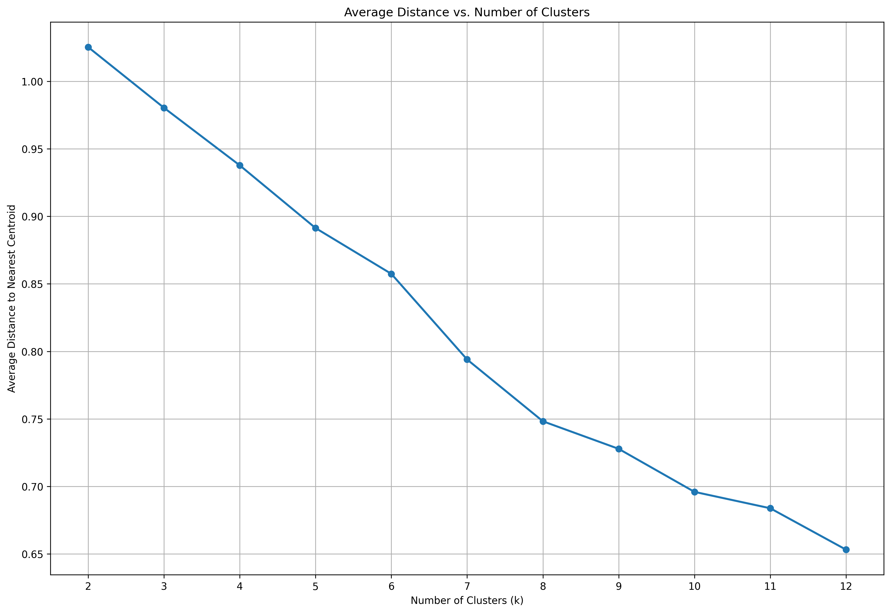

# Gearbox Sensor Outlier Detection Using K-Means Clustering

This Scala + Apache Spark application detects anomalous sensor readings (outliers) in a series of gearbox sensor logs using unsupervised learning (K-Means clustering). It processes raw CSV files containing time-series data from multiple gearbox runs, normalizes the readings, and identifies the top outliers for each K value (2 to 12).

## Features

- Reads and combines multiple CSV files of sensor data (sensor1, sensor2, sensor3)

- Automatically extracts runId from filenames

- Normalizes features using z-score standardization

- Applies K-Means clustering for different values of k (2 to 12)

- Calculates and displays:

  - Cluster centers

  - Distances to nearest centroid (for outlier scoring)

  - Top-25 most anomalous readings per cluster configuration

  - Cluster sizes

- Exports 1% of clustered data for visualization for each value of k

## ⚙️ Requirements
- **Java**: 8+ (Recommended: JDK 17)
- **Scala**: 2.12
- **Spark**: 3.5.4+
- **Python**: 3.8+ (Optional for visualization)
- **Memory**: 16GB+ recommended


## File Structure
```text
root/
│── input/
│   └── gearbox/                        # Input data set (auto-created after running download_data.sh)
└── problem3/
    ├── src/                            # Scala source code
    ├── scripts/
    │   ├── build.sh                    # Compilation script
    │   ├── run.sh                      # Analysis execution using spark-submit
    │   ├── run_shell.sh                # Analysis execution using spark shell
    │   ├── download_data.sh            # Data downloader
    │   ├── submit_local.sh             # Local pipeline runner
    │   └── submit_job.sh               # HPC job submission
    ├── output/
    │   └── GearboxOutlierDetection.jar # Compiled JAR
    ├── README.md
    └── problem3.txt
```

## 🚀 Quick Start

Navigate to scripts directory

```bash
cd scripts
```
Then elevate the scripts 

```bash
chmod +x *
```

### Option 1: Local Execution

#### 1. download data
```bash
./unzip_data.sh
```

#### 2. Build
```bash
./build.sh
```

#### 3. Run analysis
```bash
./run.sh
```

#### OR to run all 3 stages use

##### 4. Run all stages
```bash
./submit_local.sh
```

### Option 2: HPC Execution

#### 1. Run all stages by submitting a bash script

Create an interactive session by running the following on the HPC command line

```bash
salloc -p interactive --qos debug --time=2:00:00 -N 1 -n 1 -c 32
```
Then run the job interactively. This will download all required files including dataset and dependent jars before running.


```bash
./submit_job.sh
```

## Script summary

| Script            | Purpose                             |
|-------------------|-------------------------------------|
| `download_data.sh`| download dataset input data         |
| `build.sh`        | Compiles project to JAR             |
| `run.sh`          | Executes Spark analysis             |
| `submit_local.sh` | Local run wrapper (unzip+build+run) |
| `submit_job.sh`   | HPC job submission script           |

## Data visualization

After running the scripts several directories will be create containing sample data for each cluster. The data can be found under `scripts/visualization_k<n>`

This data can the be used to plot a visual 3d representation of each cluster.

**Not make sure you are in the scripts directory**


1. Create and activate a python virtual environment (Python required)

```bash 
python3 -m venv .venv
```

2. Activate the virtual environment (Linux & macOS)

```bash
source .venv/bin/activate
```

3. Install requirements

```bash
pip install -r requirements.txt
```

4. Run the visualization script
```bash
python visualization.py
```

## 📊 Sample Results

Result analysis will be saved in `scripts/result/<timestamp>.log` file after job has completed.

```text
Top-25 outliers for k = 11:
+-----+----------+---------+--------+-------+------------------+
|runId|   sensor1|  sensor2| sensor3|cluster|          distance|
+-----+----------+---------+--------+-------+------------------+
|    6|  0.015717|  0.37598|  4.9414|      3| 36.47914501366257|
|    6| 0.0028992| -0.36285|   4.928|      2|35.142386510946665|
|   68|  0.046387|  0.29297|  4.9316|      3| 27.84963139398092|
|   68|  0.050812|  0.26337|  4.9268|      3|24.793936050450426|
|   36|   0.32578|-0.042419|0.056152|      4|23.462537945215185|
|    6|  0.040436|  0.24857|  4.9304|      3| 23.17612455305191|
|   37|  0.013733|  0.23483|0.068359|      3|21.707066142667923|
|    6|-0.0028992| -0.23254|  4.9304|      2| 21.58134390038768|
|   36|   0.30136|-0.042725|0.053711|      4|21.338983634689885|
|   36|   0.29816|-0.033112|0.048828|      4|20.897988021994053|
|    6| 0.0074768| -0.22537|  4.9292|      2|20.749459290916832|
|  104|   0.28778|-0.016479|0.062256|      4|19.811921059553526|
|    6|   0.01297|  0.21561|   4.939|      3|19.704322019265057|
|   68|  0.036316|  0.21408|0.037842|      3| 19.54798622344105|
|   68|  0.050201| -0.20752|0.046387|      2|18.965863097775635|
|  104|    0.2713|-0.030212|0.057373|      4|18.501451238057403|
|  104|   0.26794|0.0090027|0.043945|      4|18.088396899059493|
|   68| -0.011749| -0.19684|  4.9109|      2|  17.9960712377571|
|   68| -0.016632|  -0.1947|   4.906|      2| 17.85855299948712|
|   37|  0.015259|  0.19714|0.058594|      3|17.760585926756598|
+-----+----------+---------+--------+-------+------------------+
only showing top 20 rows

Average distance to nearest centroid for k = 11: 0.6838337317139542
Cluster sizes:
+-------+-------+
|cluster|  count|
+-------+-------+
|      0|1749285|
|      1|1806434|
|      2| 290214|
|      3| 376940|
|      4| 205644|
|      5|2398789|
|      6|2337157|
|      7|2564140|
|      8| 159275|
|      9| 400394|
|     10|2233972|
+-------+-------+


========== Running K-means with k = 12 ==========
Cluster centers for k = 12:
Cluster 0: [-0.05749402998462037,-0.018528071803251694,-0.9659621802231654]
Cluster 1: [-0.1725564929581503,-0.6745168243463208,1.033878903736705]
Cluster 2: [-0.4332575366832642,1.0273417301089431,-0.9656747061676869]
Cluster 3: [0.36799899010295467,2.98677361441762,0.3408556498955756]
Cluster 4: [0.9651367052980598,0.5303305519884385,-0.9658983896895814]
Cluster 5: [-3.9578005070197344,0.6866617034118756,0.19083596110353046]
Cluster 6: [-0.4215486966323693,0.4456335401971448,1.0339901408943084]
Cluster 7: [0.3287521063991584,-1.0211014074663487,-0.9657481588249257]
Cluster 8: [4.000655287900342,-0.807406965180934,0.07130012274834074]
Cluster 9: [-0.16900124539698552,-3.1788260416522944,0.3270763520912577]
Cluster 10: [0.6556003199440847,0.24027005746672456,1.033555368313636]
Cluster 11: [-1.3358636937498927,-0.7667367879178405,-0.9220263530563558]

Top-25 outliers for k = 12:
+-----+----------+---------+--------+-------+------------------+
|runId|   sensor1|  sensor2| sensor3|cluster|          distance|
+-----+----------+---------+--------+-------+------------------+
|    6|  0.015717|  0.37598|  4.9414|      3| 36.35280777039879|
|    6| 0.0028992| -0.36285|   4.928|      9|34.955595964881724|
|   68|  0.046387|  0.29297|  4.9316|      3|27.706133534452782|
|   68|  0.050812|  0.26337|  4.9268|      3| 24.64540483996404|
|   36|   0.32578|-0.042419|0.056152|      8| 23.27257488122678|
|    6|  0.040436|  0.24857|  4.9304|      3|23.031931109845182|
|   37|  0.013733|  0.23483|0.068359|      3|21.610463038848735|
|    6|-0.0028992| -0.23254|  4.9304|      9|21.368358863955002|
|   36|   0.30136|-0.042725|0.053711|      8| 21.14731304258011|
|   36|   0.29816|-0.033112|0.048828|      8|20.711747749638654|
|    6| 0.0074768| -0.22537|  4.9292|      9| 20.55195372948222|
|  104|   0.28778|-0.016479|0.062256|      8| 19.63646104617177|
|    6|   0.01297|  0.21561|   4.939|      3|19.576510508243356|
|   68|  0.036316|  0.21408|0.037842|      3|19.437556522035543|
|   68|  0.050201| -0.20752|0.046387|      9|18.879834898110985|
|  104|    0.2713|-0.030212|0.057373|      8|  18.3156016400437|
|  104|   0.26794|0.0090027|0.043945|      8|17.934856907321773|
|   68| -0.011749| -0.19684|  4.9109|      9| 17.75590703837689|
|   37|  0.015259|  0.19714|0.058594|      3|17.668489316093204|
|   58|  0.041809|  0.19638|0.061035|      3|17.621795636873543|
+-----+----------+---------+--------+-------+------------------+
only showing top 20 rows

Average distance to nearest centroid for k = 12: 0.6539976340477411
Cluster sizes:
+-------+-------+
|cluster|  count|
+-------+-------+
|      0|3285622|
|      1|2232844|
|      2|1012186|
|      3| 313206|
|      4|1085986|
|      5| 188862|
|      6|2223871|
|      7|1120579|
|      8| 180698|
|      9| 252976|
|     10|1976837|
|     11| 648577|
+-------+-------+
```

### K11 visualization



### K12 visualization




### Average Distance vs K

